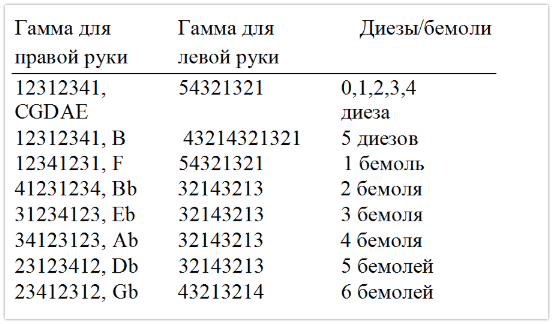
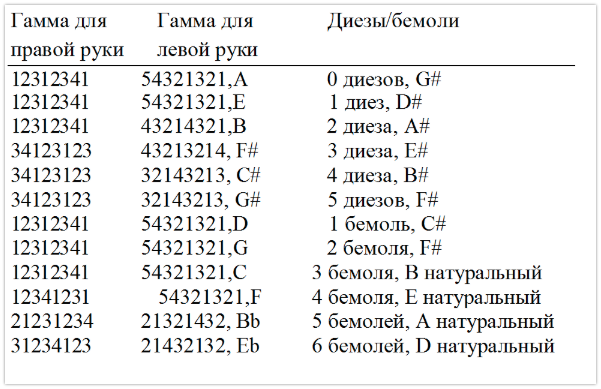

## 29 - Гаммы: Обозначения и расстановка пальцев (аппликатура) {#ch29}

Разучивание **гамм и арпеджио** необходимо для отработки базовых исполнительских техник и навыка игры с листа, при этом пассажи следует доводить до автоматизма, чтобы играть, не задумываясь о том, как попасть нужным пальцем в нужную ноту. Практиковать игру нужно и в минорном, и в мажорном ладу. После освоения аппликатуры нет необходимости практиковать ее каждый день, хотя, нужно заметить, она представляет собой прекрасное упражнение для разминки.

В главе [76 - Хроматическая гамма](#ch76) можно узнать откуда появились гаммы – хроматическая и другие, – а также узнать об их характерных особенностях. Здесь же мы обсуждаем обозначения и аппликатуры. Для теоретических целей используется кодировка нот буквенными обозначениями C D E F G A B; для пения см. Сольфеджио ([68 - Теория, Сольфеджио](#ch68)).

Исторически ноты на белых клавишах фортепиано структурированы относительно тональности до мажор, можно сказать, что в этом случае наши предшественники допустили ошибку. Гораздо лучше было бы расположить клавиши на клавиатуре «равномерно», просто чередуя черные и белые клавиши. Это бы «уменьшило» октаву на одну клавишу, исполнителям было бы легче брать широкие аккорды, нужно было бы выучить всего четыре аппликатуры, существенно бы облегчилось транспонирование, особенно на целый интервал, упростилось бы исполнение арпеджио и хроматических гамм, расстояние между черными клавишами было бы одинаковым везде, что снизило бы количество ошибок, а учащиеся осваивали бы инструмент гораздо быстрее. Единственным недостатком, пожалуй, стало бы более узкое расстояние между черными клавишами, что было бы неудобно для исполнителей с широкими пальцами.

К сожалению, в результате исторической практики до мажор не назвали ля мажором. Таким образом, октавные числа изменяются на До, а не Ля; поэтому на C4 ноты имеют нумерацию A3, B3, C4, D4, … . . Названия нот были даны для скрипки, настроенной на Ля, о том, насколько это подходит для клавиатуры никто не думал. Не было никакой причины, по которой скрипку нельзя было бы настроить на частоту 440 Герц, и если бы это случилось, то Ля мажор на фортепиано игрался бы только белыми клавишами. Первая ступень мажорного или минорного лада называется тоникой, т.е. нота До — это тоника До-мажорной гаммы. Самая низкая нота на клавиатуре из 88 клавиш это А(0), а самая высокая — С8.

Стандартные аппликатуры восходящих **мажорных гамм** (Таблица 1.1) – это 12312345 (правая рука, одна октава), 54321321 (левая рука) для мажорных гамм C, G, D, A, E (с диезами 0,1,2,3,4, соответственно). В ряду F, C, G, D, A количество диезов увеличивается (в гамме соль-мажор присутствует F#, в гамме ре-мажор – F# и C#, в гамме ля-мажор – F#, C#, G# и т. д.), в F, Bb, Eb, Ab, Db, Gb, мажорные гаммы, в ряду B, E, A, D, G, увеличивается количество бемолей; каждый интервал между соседствующими ступенями является пятым. Открытые струны на скрипке — это соль, ре, ля, ми. Буквенная последовательность постоянная – GDAEBFC – и представляет собой квинтовый круг, ее нужно запомнить. Поскольку это круг, за C естественно следует G. Если взглянуть на гамму си-мажор или соль-бемоль мажор, то можно увидеть, что на нотной линейке в одну последовательность выстраиваются 5 диезов или 6 бемолей. Таким образом, 2 диеза будут фа-диезом и до-диезом, три диеза — фа-диезом, до-диезом, соль-диезом и т.д. Бемоли добавляются в обратном порядке по сравнению с диезами. Отличительным признаком гаммы является ключевой знак; так, ключевым знаком соль-мажорной гаммы является фа-диез (F#). Учитесь распознавать интервалы квинтового круга на клавиатуре; после этого играть гаммы в порядке увеличения количества диезов (идти квинтами от До вверх) или бемолей (идти квинтами вниз) для вас не составит труда, вы даже не будете заглядывать в ноты.

С **минорными гаммами** сложнее, потому что они подразделяются на три группы; сбивать с толку может и то, что зачастую их называют просто «минорными», не уточняя к какой именно группе относится гамма, не облегчает положения и то, что одна и та же гамма может именоваться в разных источниках по-разному. Минорные гаммы нужны для создания особого настроения. Простейшей минорной гаммой является **параллельный минор** (также называемый «натуральным минором»); простой он потому, что имеет тот же ключевой знак, что и его мажорная родственница; по теории, тоника параллельного минора движется до шестой ноты его мажорной сестры. Мне легче запомнить его как минор с пониженной третьей, а не повышенной шестой ступенью. Например, тональности Соль мажор и Ми минор являются параллельными по отношению друг к другу. Тоникой параллельного минора является Ми, а ключевым знаком Фа диез. Другой вид минора – мелодический минор; в котором при движении гаммы вверх повышаются сразу две ступени – шестая и седьмая; зато при обратном (нисходящем) движении эти повышения отменяются, и играется параллельный минор. Третий и наиболее часто используемый минор – гармонический минор, его звукоряд отличается от звукоряда параллельного минора повышенной 7-й ступенью. Аппликатура для игры минорных гармонических гамм показана в таблице 1.2. В последнем столбце показана повышенная ступень минорной гаммы: таким образом, гармонический Ля минор — это ABCDEFG#A, а параллельный ему мажор — это Соль мажор.

Таблица 1.1 Восходящие мажорные гаммы

Таблица 1.2 Восходящие гармонические минорные гаммы

