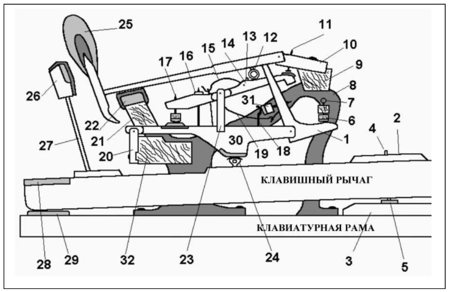

## 80 - Схема механики рояля {#ch80}

1. Шпиллер
2. Клавиша
3. Направляющий штифт
4. Клавиатурный штифт
5. Друкшайба
6. Ауслейзерная пупка
7. Ауслейзерный лейстик
8. Стойка механики
9. Гаммербанк
10. Капсюль молоточка
11. Абник
12. Шультер
13. Установочный винт рычага
14. Репетиционный рычаг
15. Репетиционная пружина
16. Установочный винт репетиционного рычага
17. Винт регулировки репетиционного рычага
18. Ложка — контроль шпиллера
19. Пружина шпиллера
20. Капсюль фигуры
21. Гаммерлейстик
22. Подушка гаммерлейстика
23. Капсюль репетиционного рычага
24. Пилот
25. Молоточек
26. Фенгер
27. Проволочное крепление фенгера
28. Фильцевая подушка для демпферной ложки
29. Клавиатурный польстер
30. Фигура
31. Шпиллерная пружина
32. Фигурный лейстик

Более подробные схемы представлены на сайте: [https://www.pianoparts.com/grand/](https://www.pianoparts.com/grand/)

На Youtube есть множество роликов, демонстрирующих работу механики.
